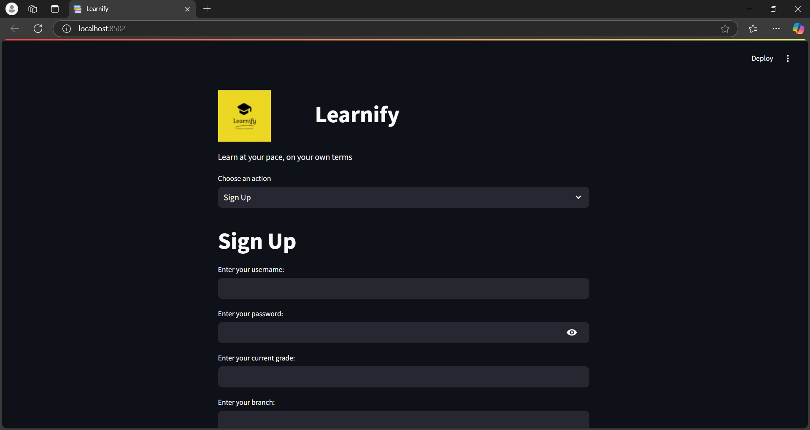
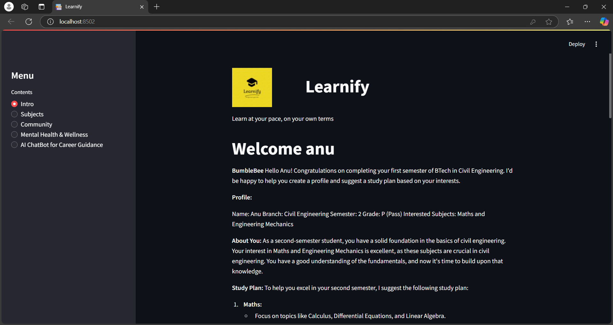

LEARNIFY
Basic Details:
Team Name: TECH TITANS

Team Members:
Member 1: DEVIKA SAJEESH - COLLEGE OF ENGINEERING TRIVANDRUM
Member 2: ANNAPOORNA M - COLLEGE OF ENGINEERING TRIVANDRUM
Member 3: SARAH MARY JACOB - COLLEGE OF ENGINEERING TRIVANDRUM

Hosted Project Link:

Project Description:
This project is a personalised student assistance system with an AI Chatbot. It has many features like visual and textual resources, Mental Health support system which is able to track one's mood, provide tips for stress management, breathing exercises, and a specialised meditation timer.

The Problem statement
Despite the increasing availability of online educational resources, students still face significant challenges in staying engaged and supported. There is a lack of personalized assistance that can help students manage their academic tasks, mental health, and well-being.

The Solution:
Learnify ,introduces its Personalized Student Assistance System that integrates both academic support and mental health resources into a single platform. Our, AI-based Chatbot, Bumblebee, that helps students mentally and academically so that they become the ninjas of knowledge-calm and collected, and slicing through their studies. The system provide an AI-powered chatbot and offers personalized learning and career guidance, track mood and stress levels.

Technical Details:
For Software:
Languages used-PYTHON
Frameworks used-STREAMLIT
Libraries used-streamlit,PyMySQL,hashlib,groq,webbrwser,time,os
Tools used-MySQL,webbrowser,groq API

Implementation
python

Installation
math
hashlab
PyMYSQL
hashlab
groq

Run
streamlit run app.py

Project Documentation
For Software:

Screenshots

Build Photos

Project Demo
Video

<video controls src="demo.mp4" title="Title"></video>

Team Contributions
Devika Sajeesh: AI Chatbot
Annapoorna M: SQL Connectivity and Resources
Sarah Mary Jacob: Resource section and framework
Made with ❤️ at TinkerHub
LEARNIFY
Basic Details:
Team Name: TECH TITANS

Team Members:
Member 1: DEVIKA SAJEESH - COLLEGE OF ENGINEERING TRIVANDRUM
Member 2: ANNAPOORNA M - COLLEGE OF ENGINEERING TRIVANDRUM
Member 3: SARAH MARY JACOB - COLLEGE OF ENGINEERING TRIVANDRUM

Hosted Project Link:

Project Description:
This project is a personalised student assistance system with an AI Chatbot. It has many features like visual and textual resources, Mental Health support system which is able to track one's mood, provide tips for stress management, breathing exercises, and a specialised meditation timer.

The Problem statement
Despite the increasing availability of online educational resources, students still face significant challenges in staying engaged and supported. There is a lack of personalized assistance that can help students manage their academic tasks, mental health, and well-being.

The Solution:
Learnify ,introduces its Personalized Student Assistance System that integrates both academic support and mental health resources into a single platform. Our, AI-based Chatbot, Bumblebee, that helps students mentally and academically so that they become the ninjas of knowledge-calm and collected, and slicing through their studies. The system provide an AI-powered chatbot and offers personalized learning and career guidance, track mood and stress levels.

Technical Details:
For Software:
Languages used-PYTHON
Frameworks used-STREAMLIT
Libraries used-streamlit,PyMySQL,hashlib,groq,webbrwser,time,os
Tools used-MySQL,webbrowser,groq API

Implementation
python

Installation
math
hashlab
PyMYSQL
hashlab
groq

Run
streamlit run app.py

Project Documentation
For Software:

Screenshots

Build Photos

Project Demo
Video
<video controls src="demo.mp4" title="Title"></video>

Team Contributions
Devika Sajeesh: AI Chatbot
Annapoorna M: SQL Connectivity and Resources
Sarah Mary Jacob: Resource section and framework
Made with ❤️ at TinkerHub
