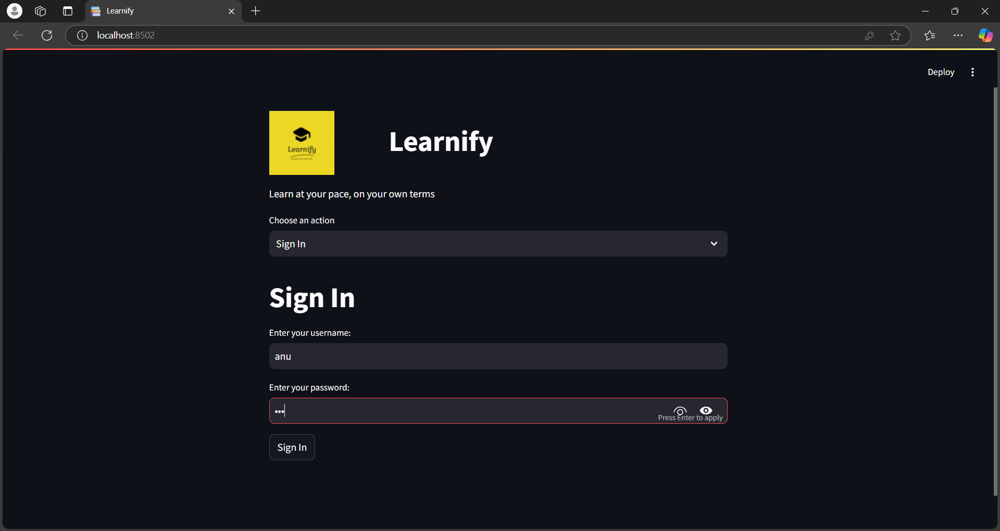
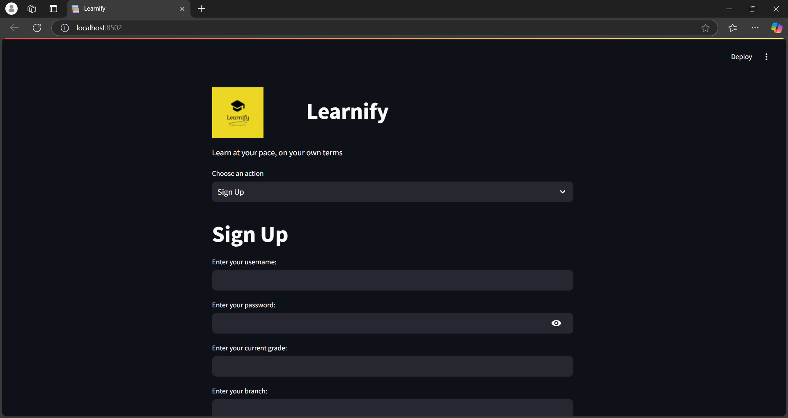
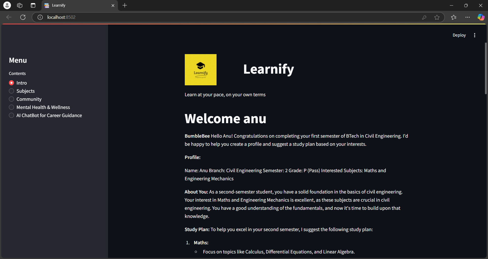
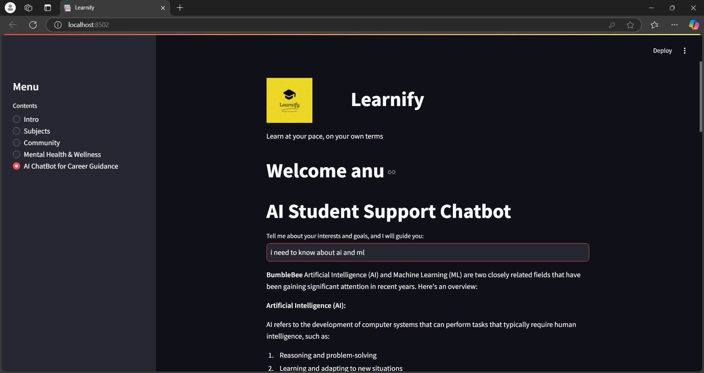
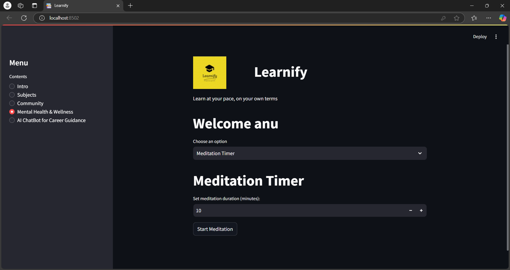

# 🚀 Learnify – Personalized Student Assistance System

🔗 **Live Demo**: [https://learnify.streamlit.app](https://learnify-igscraddpe8unhqnwxkcxe.streamlit.app/)  
🎥 **Demo Video**: [Watch on Google Drive](https://drive.google.com/file/d/1deFvijQjX2_EC9eVYh-4_IlDn-Iid0n3/view?usp=sharing)  
📁 **GitHub Repository**: [https://github.com/Devika-Sajeesh/learnify](https://github.com/Devika-Sajeesh/learnify)

---

## 📚 Overview

Learnify is a personalized student assistance system that integrates academic tools and mental wellness resources into a unified platform. With an AI-powered chatbot, dynamic study planner, resource hub, and mental health tools, Learnify helps students stay on track both academically and emotionally.

🏆 **6th Place Winner** at **TinkerHack** 2025  
👥 Built by **Team TECH TITANS**

---

## 🧠 Problem Statement

Despite the abundance of online educational content, students continue to face:

- Lack of **personalized learning guidance**
- Difficulty in **tracking academic tasks and timelines**
- Poor access to **mental health tools integrated within academic platforms**

---

## 💡 Solution

Learnify addresses these challenges by offering:

✅ **Bumblebee – An AI-powered chatbot** trained to provide academic advice, motivation, and mental health check-ins  
✅ **GPA-based personalized study plans**  
✅ **Mental health support**: mood tracker, stress management tips, breathing exercises, and meditation timer  
✅ **Visual and textual resources** curated by subject and difficulty level  
✅ **Q&A forum** to promote peer learning

---

## ⚙️ Tech Stack

### 🔧 Backend & Framework

- **Language**: Python
- **Framework**: Streamlit
- **Database**: MySQL
- **Authentication**: SHA-256 + Salted Password Hashing

### 📦 Libraries Used

- `streamlit`, `pymysql`, `hashlib`, `groq`, `webbrowser`, `time`, `os`

### 🧠 AI Integration

- **LLM**: Meta’s **LLaMA3-70B** via **Groq API**
- **Chatbot Name**: Bumblebee

---

## 🛠️ Installation

### 🔽 Clone the Repo

```bash
git clone https://github.com/Tech-Titans/Learnify.git
cd Learnify
```

### 📦 Install Dependencies

```bash
pip install -r requirements.txt
```

### 🚀 Run the Application

```bash
streamlit run app.py
```

---

## 📂 Project Structure

```
Learnify/
├── app.py
├── assets/
│   ├── SignIn.png
│   ├── SignUp.png
│   ├── Intro.png
│   ├── ai_chatbot.png
│   └── MentalHealth.png
├── requirements.txt
└── README.md
```

---

## 🖼️ Screenshots

| Feature       | Screenshot                   |
| ------------- | ---------------------------- |
| Sign In       |        |
| Sign Up       |        |
| Intro         |         |
| AI Chatbot    |    |
| Mental Health |  |

---

## 🔐 Security Notes

- User passwords are **securely hashed and salted**
- Secrets like API keys are stored in `.streamlit/secrets.toml` (excluded from GitHub)
- Streamlit handles session isolation and form state

---

## 📈 Limitations & Future Scope

### Current Limitations:

- No persistent chatbot sessions
- No real-time push notifications
- UI built on Streamlit (limited styling flexibility)

### Future Plans:

- Upgrade to a full-stack framework (e.g., Next.js + FastAPI)
- Add multi-language support and mobile version
- Integrate academic calendar and exam countdowns
- Collect and analyze user feedback using analytics

---

## 👩‍💻 Team TECH TITANS

| Name             | Role                                       |
| ---------------- | ------------------------------------------ |
| Devika Sajeesh   | AI Chatbot, Mental Health System, Frontend |
| Annapoorna M     | SQL Connectivity, Resource Integration     |
| Sarah Mary Jacob | Study Planner, UI Layout, Content          |

---

## 💙 Made With

- ❤️ Passion for innovation
- 🧠 Curiosity for AI and mental health tech
- 🤝 Team spirit at **TinkerHack 2025**

---

## 📢 Feedback or Contributions?

Feel free to submit issues or PRs if you'd like to contribute!
We’d love to hear your feedback and make Learnify better for all students.

```

```
